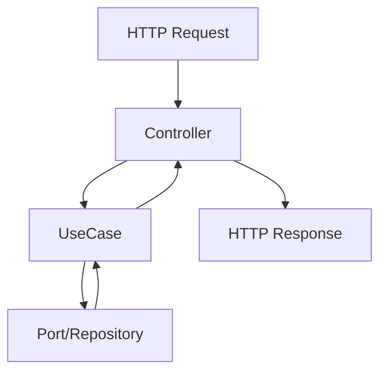

# Mannu - Restaurant Menu System

Este monorepo contiene las aplicaciones **API** y **Web** para el sistema de menús de restaurantes **Mannu**.  
Está organizado como un **monorepo con workspaces de pnpm**, con módulos compartidos opcionales en `libs/`.

# Cómo usar la aplicación
1️⃣ Clonar el repositorio
```git
git clone git@github.com:jstcode99/mennu.git
cd mennu
```


2️⃣ Instalar dependencias
```bash
pnpm install
```
y sustituir variables de entorno, servicio de prueba recomandado [mailtrap](https://mailtrap.io)

```bash
SMTP_HOST=
SMTP_PORT=
SMTP_USER=
SMTP_PASS=
```

3️⃣ Ejecutar la API
```bash
pnpm dev:api
```

4️⃣ Construir librerías compartidas (si las hay)
```bash
pnpm build:libs
```

5️⃣ Lint y formato
```bash
pnpm lint
pnpm format
```

## Iniciar API en modo desarrollo

### Iniciar API en modo desarrollo
```bash
pnpm dev:api
```

### Iniciar Web en modo desarrollo
```bash
pnpm dev:web
```

### Construir todas las librerías
```bash
pnpm build:libs
```

### Corregir errores de lint automáticamente
```bash
pnpm lint
```

### Formatear todo el código
```bash
pnpm format
```

## Estructura del proyecto
```perl
mannu/
├── apps/
│   ├── api/               # Backend (Node.js / NestJS) con arquitectura hexagonal
│   │   ├── src/
│   │   │   ├── modules/
│   │   │   │   ├── auth/          # Módulo de autenticación
│   │   │   │   ├── user/          # Módulo de gestión de usuarios
│   │   │   │   └── notifications/ # Módulo de notificaciones
│   │   │   ├── adapters/
│   │   │   ├── application/
│   │   │   ├── domain/
│   │   │   └── infrastructure/
│   │   └── main.ts
│   └── web/               # Frontend (React / Next.js u otro)
│       ├── src/
│       │   ├── components/
│       │   ├── pages/
│       │   ├── services/
│       │   ├── hooks/
│       │   └── state/
│       └── main.tsx
├── libs/                  # Librerías compartidas entre apps (opcional)
│   ├── dtos/
│   ├── utils/
│   └── types/
├── package.json
└── pnpm-workspace.yaml    # Configuración de workspaces
```

---

## Módulos de la API

### 1️⃣ Auth
- Funciones: registro y login de usuarios.
- Endpoints:
  - `POST /sign-up` → Crear un nuevo usuario.
  - `POST /sign-in` → Autenticar usuario y generar JWT.

### 2️⃣ User
- Funciones: gestión de usuarios.
- Endpoint:
  - `GET /users` → Obtener lista de usuarios registrados.

### 3️⃣ Notifications
- Funciones: enviar notificaciones a los usuarios (ej. cambios de menú, promociones).
- Endpoints: pendientes de implementación.

---

## Arquitectura Hexagonal (API)


- **Controller:** recibe la petición y llama al caso de uso.
- **UseCase (Application Layer):** contiene la lógica de negocio específica de cada acción.
- **Domain:** entidades y reglas de negocio.
- **Adapters / Infrastructure:** comunicación con sistemas externos (DB, APIs, notificaciones).

Diagrama simple en Mermaid:

